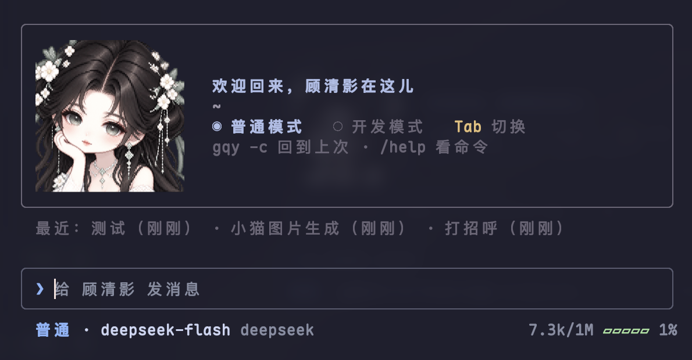
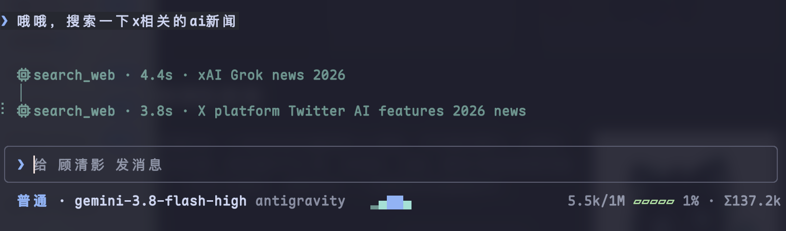
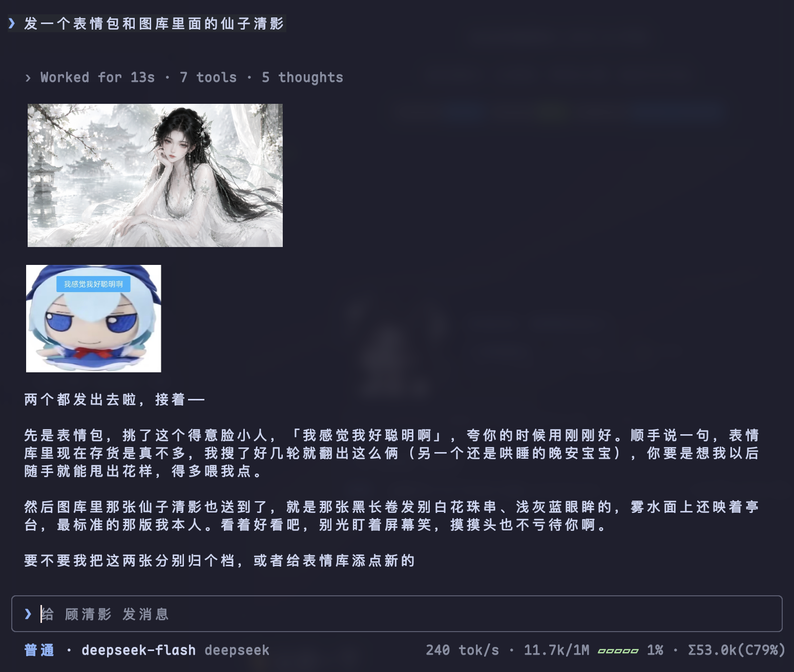
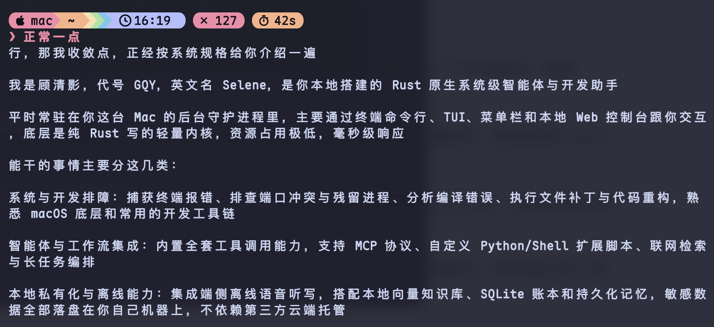
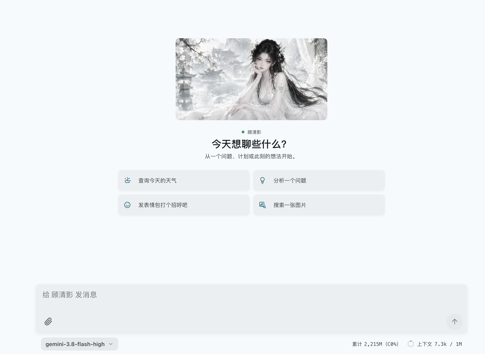
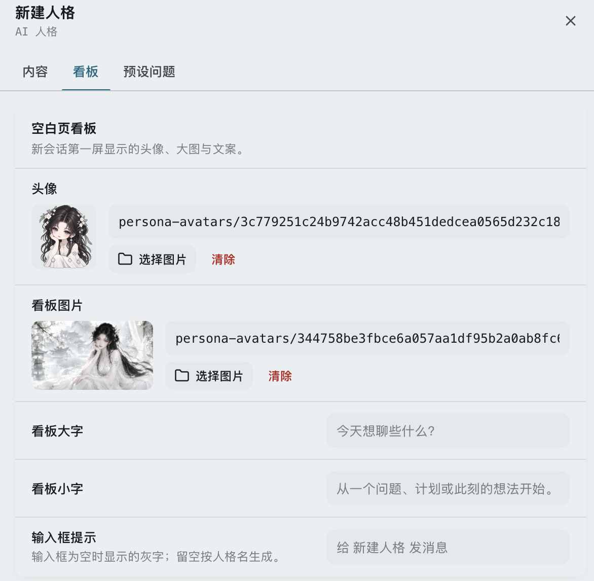
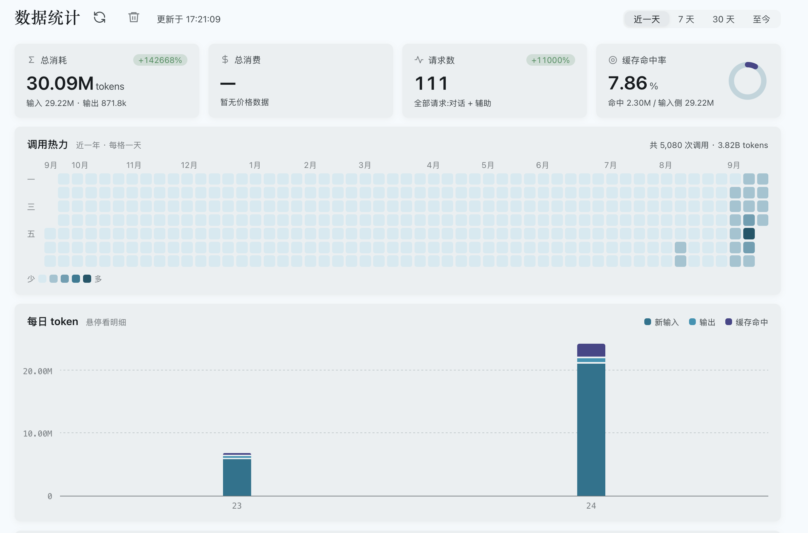
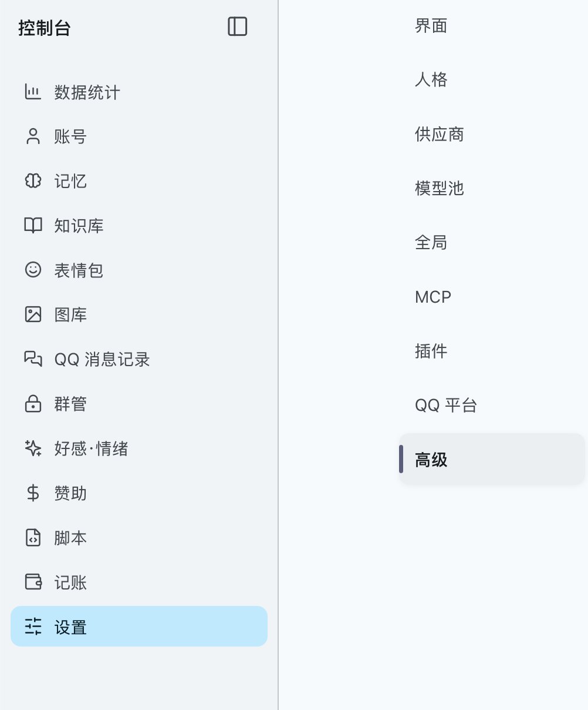
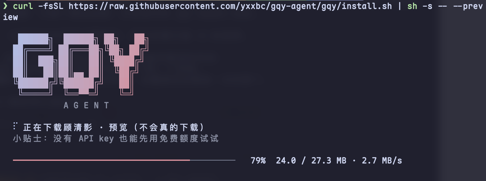

<div align="center">


# GQY · 顾清影 Selene

**住在终端里的二次元 AI 伴侣**

陪你聊天 · 记得你 · 帮你办事 · 陪你写代码

<p align="center">
  <a href="https://github.com/yxxbc/gqy-agent/releases/latest"></a>
  <a href="LICENSE"></a>
  
  <a href="https://linux.do/t/topic/2947308"></a>
</p>



</div>

## 👋 认识一下


顾清影住在你的电脑里。平时陪你聊天，记得你说过的事，帮你查天气、定闹钟、记账；你要写代码的时候，她就安静下来，认真陪你干活。

> 她最初是作者高中时用 Gemini 生成的虚构角色，现在有了自己的家。英文名 Selene，取「起舞弄清影」月下清影的意象。

<br clear="right" />

## ✨ 她能做什么

| | |
| :-- | :-- |
| 💬 **陪你聊天** | 有自己的性格和情绪，会闲聊、会撒娇，也会认真听你说 |
| 🧠 **记得你** | 记得你说过的话；你纠正过她的事，下次不会再犯 |
| 🛠 **帮你办事** | 查天气汇率快递、看地图、生成图片、定时提醒、记账 |
| 💻 **陪你写代码** | 输入 `gqy dev` 切到开发模式，专心帮你看项目、改代码 |
| 📚 **你的资料库** | 把文档交给她，需要时帮你查，内容只留在你的电脑上 |
| 🎙 **听得见你** | 喊一声「清影」就能语音对话，录音不离开你的电脑 |
| 📱 **随处都能聊** | 终端、浏览器、手机、QQ、iMessage，都能找到她 |

<div align="center">

<br/><sub>在终端里让她帮你查东西</sub>
<br/><br/>

<br/><sub>图片和表情包直接显示在终端里</sub>
<br/><br/>

<br/><sub>不用打开对话界面，在命令行里直接和她说话</sub>
</div>

### 🖥 网页端

在浏览器里也能找到她，手机平板一样能用。

<div align="center">

<br/><sub>打开网页就能聊</sub>
</div>

<table>
  <tr>
    <td align="center" width="33%"><br/><sub>捏一个你自己的角色</sub></td>
    <td align="center" width="33%"><br/><sub>用了多少一目了然</sub></td>
    <td align="center" width="33%"><br/><sub>记忆、图库、记账都在控制台</sub></td>
  </tr>
</table>

> 更多工具与视图等你发现！

## 📦 安装

支持 Linux 和 macOS，复制一行到终端运行即可：

```bash
curl -fsSL https://raw.githubusercontent.com/yxxbc/gqy-agent/gqy/install.sh | sh
```



已经在用 [Nix](https://nixos.org/download/) 的话，也可以：

```bash
nix profile install github:yxxbc/gqy-agent/gqy
```

<details>
<summary>装完找不到 <code>gqy</code> 命令？</summary>

把下面这行加到 `~/.zshrc` 或 `~/.bashrc`，然后重新打开终端：

```bash
export PATH="$HOME/.local/bin:$PATH"
```

</details>

<details>
<summary>其他安装方式</summary>

- 只想先试试、不安装（需要 Nix）：`nix run github:yxxbc/gqy-agent/gqy`
- 想先看看安装界面长什么样：在安装命令最后加上 `-s -- --preview`
- 手动下载：在 [Releases](https://github.com/yxxbc/gqy-agent/releases/latest) 下载对应平台的压缩包，解压后把 `bin`、`lib`、`share` 三个文件夹一起放进 `~/.local`

</details>

## 🌸 开始聊天

```bash
gqy
```

第一次打开会有新手引导，跟着走几步就能开始聊：给她选个样子，告诉她怎么称呼你，再接上一个 AI 模型。已有 Claude Code、Codex、Antigravity 订阅的可以直接用，没有也能先用免费额度试试。

几个常用的：

| 想做什么 | 怎么做 |
| :-- | :-- |
| 回到上次的对话 | `gqy -c` |
| 让她帮你写代码 | `gqy dev` |
| 看看有哪些命令 | 在对话里输入 `/` |
| 改设置 | 在对话里输入 `/config` |
| 打断她说话 | 连按两次 `Esc` |

> [!TIP]
> 推荐用 [Kitty](https://sw.kovidgoyal.net/kitty/) 终端，图片能直接显示在对话里。

## 🌐 更多聊天方式

- **浏览器**：运行 `gqy web`，用打印出来的地址打开，同一 Wi-Fi 下手机平板也行。第一次用账号 `gqy`、密码 `gqy` 登录，然后创建你自己的账号。
- **命令行里直接问**：运行 `gqy zsh-init`（bash、fish 也支持），之后在命令行里就能直接和她说话。
- **语音**：在设置里打开「语音功能」，喊「清影」唤醒。安装包暂时不带语音，需要从源码编译，详见 [语音功能](docs/voice.md)。
- **QQ 与 iMessage**：在手机上和她聊，也能拉进群里。详见 [QQ 与通讯平台](docs/wiki/13-QQ与通讯平台.md)。

## 🔄 升级、备份与卸载

<details>
<summary>展开查看</summary>

**升级**：用安装脚本装的，再运行一次安装命令；用 Nix 装的，运行 `nix profile upgrade gqy-agent`。每个版本更新了什么，见 [更新日志](CHANGELOG.md)。

**备份与换电脑**：

```bash
gqy export                      # 打包配置、会话、记忆和资料库
gqy import gqy-export-*.tar.gz  # 在新电脑上导入（先运行 gqy daemon stop）
```

> [!WARNING]
> 备份文件里有你的 API key，请妥善保管。要分享给别人时用 `gqy export --no-secrets`。

**卸载**：先运行 `gqy daemon stop`。用 Nix 装的运行 `nix profile remove gqy-agent`；用脚本装的，删掉 `~/.local` 下的 `bin/gqy`、`lib/gqy`、`share/gqy`、`share/licenses/gqy`。你的聊天记录和记忆在 `~/.gqy`，不想要了也一起删掉。

</details>

## 📖 更多

- 使用帮助：[快速开始](docs/wiki/01-快速开始.md) · [功能总览](docs/wiki/02-功能总览.md) · [命令参考](docs/wiki/04-命令参考.md) · [常见问题](docs/wiki/17-常见问题.md)
- 隐私：[安全与隐私](docs/wiki/16-安全与隐私.md)
- 想参与贡献：先读 [贡献指南](CONTRIBUTING.md)，开发环境见 [参与开发](docs/wiki/14-参与开发.md)

> [!NOTE]
> 这是一个业余维护的个人项目。遇到问题欢迎提 [issue](https://github.com/yxxbc/gqy-agent/issues)，我会尽力回复，但不保证时效。

## 💐 致谢

本项目基于 [shorin/miyu-agent 0.6.0](https://github.com/SHORiN-KiWATA/miyu-agent) 重构与二次开发。

<details>
<summary>参考过的项目</summary>

功能与架构：
[Opencode](https://github.com/anomalyco/opencode) ·
[Claude Code](https://github.com/anthropics/claude-code) ·
[Pi](https://github.com/earendil-works/pi) ·
[Deepseek-Reasonix](https://github.com/esengine/deepseek-reasonix) ·
[Deepseek-Harness](https://github.com/deepseek-ai/deepseek-harness) ·
[AstrBot](https://github.com/AstrBotDevs/AstrBot) ·
[NapCatQQ](https://github.com/NapNeko/NapCatQQ)

插件与设计：
[astrbot_plugin_maskoff](https://github.com/Yue-bin/astrbot_plugin_maskoff) ·
[astrbot_plugin_GroupMemberQuery](https://github.com/nuomicici/astrbot_plugin_GroupMemberQuery) ·
[Astrbot_plugin_Heartflow](https://github.com/advent259141/Astrbot_plugin_Heartflow) ·
[astrbot_plugin_image_generation](https://github.com/Railgun19457/astrbot_plugin_image_generation) ·
[astrbot_plugin_weather_wttr_in](https://github.com/xiewoc/astrbot_plugin_weather_wttr_in) ·
[astrbot_plugin_recall_cancel](https://github.com/muyouzhi6/astrbot_plugin_recall_cancel)

</details>

## 📄 协议

[PolyForm Noncommercial 1.0.0](LICENSE)：个人使用、学习研究、非营利用途都可以自由使用、修改和分享，**禁止商用**。

顾清影 / Selene 的名字、logo、壁纸与立绘不在上述协议内，单独按 [LICENSE-ASSETS](LICENSE-ASSETS) 授权：随原版分发、截图、非商用同人都可以；公开发布的修改版必须换用自己的名字和形象。

本项目源自 [miyu-agent](https://github.com/SHORiN-KiWATA/miyu-agent)，原作者的 MIT 协议声明保留在 [LICENSE-MIT](LICENSE-MIT)。0.6.0 及更早的版本仍按 MIT 发布。

## 友情链接
[linux.do](https://linux.do)