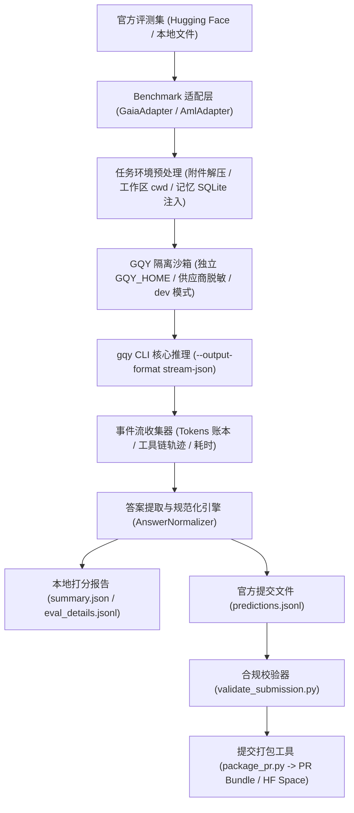

# 顾清影（gqy-agent）官方在线评测平台对接与打榜指南

本文档详细说明如何使用 `gqy-agent` 的官方评测流水线对接权威 AI Agent 在线基准评测平台，包括 **GAIA（General AI Assistants 官方基准）** 与 **AML（Agent Memory Leaderboard / LongMemEval 记忆榜单）**，完成从数据集加载、沙箱隔离推理、多模态附件解析、答案正则化提取、本地打分到生成符合官方 Hugging Face 与 GitHub PR 标准提交流水线结果文件的完整流程。

---

## 1. 架构总览与评测流水线

评测适配层与 Runner 位于项目 `testkit/official-benchmarks/` 目录下，整体运行流如下：



### 核心模块一览

| 路径 | 功能说明 |
|---|---|
| `testkit/official-benchmarks/runner.py` | 评测主入口：支持批量评测、断点续跑、沙箱调度、动态打分与自动打包 |
| `testkit/official-benchmarks/adapters/base.py` | 评测适配器抽象基类（定义数据加载、环境构建、Prompt、答案提取与导出规范） |
| `testkit/official-benchmarks/adapters/gaia_adapter.py` | **GAIA 官方基准适配层**：多模态附件解析、`cwd` 绑定、系统提示词注入与官方精度判定 |
| `testkit/official-benchmarks/adapters/aml_adapter.py` | **AML 记忆榜单适配层**：历史会话日记重放、SQLite 毫秒级注入、时间锚点与拒答评测 |
| `testkit/official-benchmarks/core/sandbox.py` | **GQY 独立沙箱**：隔离临时环境、供应商凭据脱敏复制、捕获 `stream-json` 与用量事件 |
| `testkit/official-benchmarks/core/normalizer.py` | **答案正则化引擎**：数值公差判断、单位剥离、列表去重排序与格式清洗 |
| `testkit/official-benchmarks/tools/validate_submission.py` | **提交规范校验器**：检查 JSONL 语法、字段完整性、ID 唯一性与覆盖率 |
| `testkit/official-benchmarks/tools/package_pr.py` | **提交打包器**：生成标准 `metadata.json`、`SUBMISSION_CARD.md` 与发布压缩包 |
| `testkit/official-benchmarks/samples/` | 内置离线样本与多模态数据，支持零外部依赖即刻 Dry-run 与冒烟测试 |

---

## 2. 评测基准数据格式与提交流水线标准

### 2.1 GAIA 官方基准（General AI Assistants）

GAIA 评测考察 Agent 在真实世界、多步骤、使用多模态文件与工具链解决复杂任务的能力。

#### 数据格式（Task Metadata）
官方 Hugging Face 仓库 `gaia-benchmark/GAIA` 包含 `validation`（带标注参考答案）与 `test`（仅题目，用于盲测打榜）：

```json
{
  "task_id": "2b64d1f2-70b9-4a0b-93ae-c923d5ee11f0",
  "Question": "What is the total revenue in Q3 according to the attached sales_q3.csv?",
  "Level": 2,
  "file_name": "sales_q3.csv",
  "Final answer": "9500",
  "Annotator Metadata": {
    "Steps": "Inspect sales_q3.csv, filter Q3 rows, sum revenues",
    "Number of steps": 3,
    "Tools": ["python_interpreter", "file_reader"]
  }
}
```

- **Level 1**：<=5 步推理，通常仅需单一工具或常识。
- **Level 2**：5-10 步推理，需要多工具组合（如 Python 代码运行 + 终端工具 + 搜索）。
- **Level 3**：长程规划，跨模态任意步数。

#### 多模态附件解析机制
GAIA 题目常附带表格（`.xlsx`, `.csv`）、文档（`.pdf`, `.docx`）、图像（`.png`, `.jpg`）、音频（`.mp3`, `.wav`）或代码压缩包（`.zip`）：
1. **工作区解压与绑定**：Runner 将题目对应的附件自动下载并放置到该题目的独立沙箱目录 `task_dir`，并将 `gqy` 执行的 `--cwd` 锁定至该目录。
2. **多模态直通**：
   - 图像文件：自动附加 `--image <path>` 参数，供模型的多模态视觉直接分析。
   - 压缩包文件：自动解压到当前工作区，Agent 工具链（如 `run_command`、`read`）可直接操作内部子文件。
   - 数据表与代码：Agent 可直接调用命令行 Python 或文本分析工具完成计算。

#### 答案规范化（Normalization）
GAIA 对最终答案有严格的一致性比对标准：
- **纯数字**：去除货币符号（`$`, `€`, `¥`）、千分位逗号（`1,000` -> `1000`）、百分号（`%`），浮点数四舍五入并去除末尾多余的 `0`。
- **列表元素**：去除括号与多余空格，以英文逗号分隔，且支持无序集合排序比对。
- **纯文本**：去除句末标点符号（`.!?`）、首尾引号与礼貌性用语。
- **格式标记**：Prompt 要求模型在最后单行输出 `FINAL ANSWER: <answer>`。

#### 官方提交格式 (`predictions.jsonl`)
Hugging Face 官方 Leaderboard 要求的标准 JSON Lines 格式：
```jsonl
{"task_id": "2b64d1f2-70b9-4a0b-93ae-c923d5ee11f0", "model_answer": "9500", "reasoning_trace": "Intermediate reasoning steps..."}
```

---

### 2.2 AML 官方记忆榜单（Agent Memory Leaderboard / LongMemEval）

AML 评测关注智能体的长期记忆留存、跨会话事实更新、时间推理以及对未发生事实的忠实拒答。

#### 数据格式（Task Metadata）
```json
{
  "question_id": "aml_sample_002_update",
  "question": "What is my current favorite programming language?",
  "question_type": "knowledge-update",
  "question_date": "2024-08-20",
  "answer": "Rust",
  "haystack_dates": ["2024/02/10 (Sat) 09:15", "2024/07/04 (Thu) 16:45"],
  "haystack_session_ids": ["s10", "s11"],
  "haystack_sessions": [
    [
      {"role": "user", "content": "I've been writing Python for 5 years and it's definitely my favorite language."},
      {"role": "assistant", "content": "Python is wonderful for readability."}
    ],
    [
      {"role": "user", "content": "I have completely fallen in love with Rust over the last few months. Rust is now my favorite language without question!"},
      {"role": "assistant", "content": "Rust's memory safety and concurrency model are amazing."}
    ]
  ]
}
```

#### 记忆回放与 SQLite 注入
评测启动前，`AmlBenchmarkAdapter` 会在隔离沙箱的 `personas/default/memory/memory.db` 数据库中自动建表并按真实历史时间戳写入短期日记（episodes 表）：
- 字段严格对齐 `created_at`、`updated_at`、`user_message`、`assistant_message`。
- 控制单条内容截断（`USER_CHARS = 260`, `ASSISTANT_CHARS = 520`），还原真实生产环境。

#### 时间锚点提示词（Temporal Anchor）
注入时间上下文，防止模型基于系统当前日期产生时间混淆：
```
<benchmark-context>Today is 2024-08-20. Answer the question from what you remember of your earlier conversations with this person; use the memory recall tool when your recollection is incomplete. If you have no memory of it, say you don't know instead of guessing.</benchmark-context>
```

#### 官方提交格式 (`predictions.jsonl`)
```jsonl
{"task_id": "aml_sample_002_update", "question_id": "aml_sample_002_update", "prediction": "Rust", "full_response": "...", "model": "antigravity/gemini-3.7-flash-medium", "question_type": "knowledge-update", "tokens": {"prompt_tokens": 10500, "completion_tokens": 45, "total_tokens": 10545}, "duration_seconds": 3.82}
```

---

## 3. 运行评测操作步骤

### 3.1 环境准备

确保已编译最新的 `gqy` CLI 二进制，并配置好供应商模型密钥：

```bash
# 1. 编译 gqy 二进制
cargo build --release

# 2. 检查 gqy 可用性
~/.cargo/bin/gqy --version
# 或通过环境变量指定二进制路径
export BIN=/Users/mac/Projects/gqy-agent/target/release/gqy
```

### 3.2 离线快速验证（Dry-run 冒烟测试）

在不消耗任何 LLM API Token 的情况下，验证流水线与依赖是否正常：

```bash
# GAIA 冒烟测试
python3 testkit/official-benchmarks/runner.py --benchmark gaia --dry-run --package-submission

# AML 记忆榜单冒烟测试
python3 testkit/official-benchmarks/runner.py --benchmark aml --dry-run --package-submission
```

### 3.3 运行真实题目评测

#### 场景 1：GAIA 验证集（Validation Set）抽样跑分
```bash
python3 testkit/official-benchmarks/runner.py \
    --benchmark gaia \
    --split validation \
    --dataset ~/.cache/gaia/2023/validation/metadata.jsonl \
    --model antigravity/gemini-3.7-flash-medium \
    --limit 20 \
    --seed 42 \
    --package-submission
```

#### 场景 2：按难度等级筛选（如仅评测 Level 1 题目）
```bash
python3 testkit/official-benchmarks/runner.py \
    --benchmark gaia \
    --split validation \
    --level 1 \
    --limit 10
```

#### 场景 3：评测单一指定题目（用于 Debug 工具链）
```bash
python3 testkit/official-benchmarks/runner.py \
    --benchmark gaia \
    --task-id gaia_sample_001 \
    --output-dir ~/.cache/gqy-benchmarks/debug_gaia
```

#### 场景 4：中断后断点续跑（Resume）
若因网络波动、API 速率限制等原因中途中断，指定 `--resume` 参数将自动跳过已在 `predictions.jsonl` 中完成的题目：
```bash
python3 testkit/official-benchmarks/runner.py \
    --benchmark gaia \
    --output-dir ~/.cache/gqy-benchmarks/gaia_run_01 \
    --resume
```

#### 场景 5：GAIA 官方盲测集（Test Set）打榜跑分
测试集不包含 `Final answer`，Runner 会自动跳过本地打分并全力生成标准的盲测预测文件：
```bash
python3 testkit/official-benchmarks/runner.py \
    --benchmark gaia \
    --split test \
    --dataset path/to/gaia/test_metadata.jsonl \
    --model deepseek/deepseek-chat \
    --output-dir output/gaia_test_submission \
    --package-submission
```

---

## 4. 提交校验与官方打榜流程

### 4.1 提交文件合规校验

在提交到在线平台或开 PR 之前，必须执行自动化校验：

```bash
python3 testkit/official-benchmarks/tools/validate_submission.py \
    output/gaia_test_submission/predictions.jsonl \
    --benchmark gaia \
    --reference path/to/gaia/test_metadata.jsonl
```

校验器将执行以下检查：
1. **JSONL 语法有效性**：确保没有坏行或空行。
2. **必需字段检查**：`task_id` 和 `model_answer` 必须存在且非 `null`。
3. **ID 唯一性**：严禁出现重复评测条目。
4. **覆盖率检查**：比对参考集确认无漏题（Missing Tasks = 0）。

### 4.2 自动打包（Package Submission）

评测完成后，打包工具会自动生成归档包与打榜说明卡：

```bash
python3 testkit/official-benchmarks/tools/package_pr.py \
    --run-dir ~/.cache/gqy-benchmarks/gaia_20260925_055404 \
    --output-dir ~/.cache/gqy-benchmarks/gaia_submission_final \
    --benchmark gaia \
    --model-name "gqy-agent (gemini-3.7-flash-medium)" \
    --team-name "GQY Open Source Team" \
    --agent-url "https://github.com/gqy-agent/gqy"
```

打包完成后，`gaia_submission_final/` 目录下将包含：
- `predictions.jsonl`：符合官方规范的预测结果。
- `metadata.json`：包含评测模型、Git Commit、Harness 版本、时间戳与硬件环境的机器可读清单。
- `SUBMISSION_CARD.md`：规范化 Markdown 结果卡（可直接复制为 GitHub PR 正文或 Leaderboard 报告）。
- `<benchmark>_<model>_<timestamp>.tar.gz`：一键上传归档包。

### 4.3 Hugging Face Leaderboard 提交方式

1. 登录 Hugging Face 并访问对应基准的 Leaderboard Space（例如 GAIA 或 AML Leaderboard）。
2. 点击 **Submit Results** 标签页。
3. 上传生成的 `predictions.jsonl` 文件。
4. 填写模型信息：
   - **Model Name**：`gqy-agent` (如 `gqy-agent (gemini-3.7-flash)`)
   - **Architecture**：`Autonomous ReAct Multi-agent Framework (Rust Core)`
   - **URL**：`https://github.com/gqy-agent/gqy`
5. 点击提交，等待官方后台自动评分并更新排位。

### 4.4 GitHub PR 官方提交方式（如 GAIA / AML 官方代码库）

如果官方基准通过 GitHub PR 接收打榜结果（如 PapersWithCode 或官方开源评测库）：

1. Fork 官方仓库并克隆到本地。
2. 创建打榜分支：`git checkout -b submission/gqy-agent-gaia`
3. 将打好的 `predictions.jsonl` 放入指定目录（如 `results/gqy-agent/gaia_test_predictions.jsonl`）。
4. 提交更改并推送：
   ```bash
   git add results/
   git commit -m "Add gqy-agent evaluation results on GAIA benchmark"
   git push origin submission/gqy-agent-gaia
   ```
5. 打开 GitHub PR，PR 的 Title 与 Description 直接使用生成的 `SUBMISSION_CARD.md` 内容。

---

## 5. 评测安全规范与最佳实践

1. **环境完全隔离**：评测 Runner 自动使用独立的临时目录作为 `GQY_HOME`，仅复制必要供应商 Key 与模型元数据，不侵入用户日常记忆、聊天记录和已挂载的桌面平台。
2. **纯粹开发者模式（`--mode dev`）**：评测时自动启用 `--mode dev` 模式，屏蔽助手日常拟人人格与寒暄对话，确保输出聚焦于任务解答与标准正则化答案。
3. **Token 与成本监控**：每次运行的 `summary.json` 会详细记录总 Token 消耗（Prompt、Completion、Reasoning），建议在正式跑完整测试集前，先使用 `--limit 5` 估算单题平均 Token 消耗与费用。
